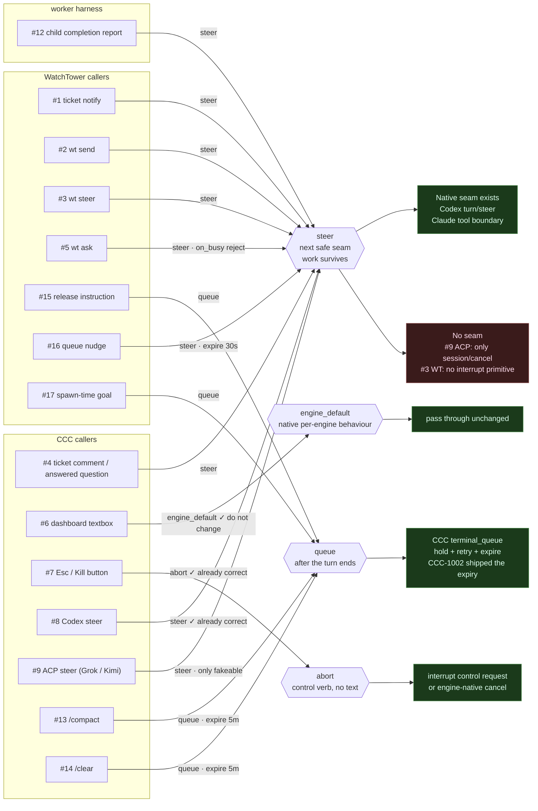
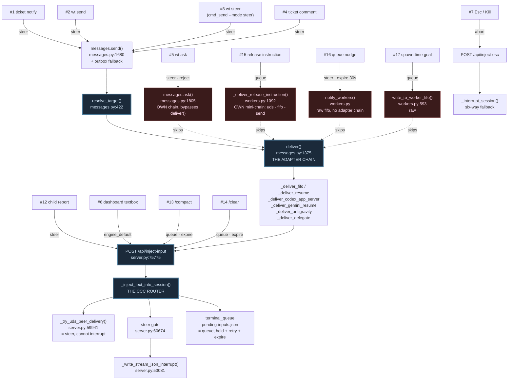
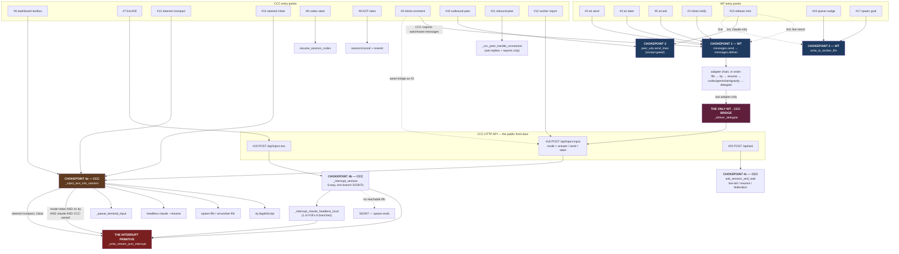

Pulled every mode branch and interrupt call site instead of guessing. Full picture, achi — the whole confusion this session came from "steer" meaning two different things.

**There are TWO interrupt mechanisms, not one.** The original version of this doc claimed only the first exists and that "anything that doesn't reach it can't interrupt." That is false, and the second one is the one that actually bit us in production.

### Mechanism 1 — the explicit control request

`_write_stream_json_interrupt` (**CCC** `server.py:53081`). It aborts an in-flight tool, ends the turn, keeps the process alive.

It has **four** call sites, not one — all in CCC, and all four first require a live CCC-owned `claude` spawn via `_find_live_spawn_entry_for_session`. A foreign session, or any non-`claude` engine, can never be interrupted, no matter what "priority" label you slap on the JSON:

| Call site | Trigger | Row |
|---|---|---|
| `server.py:60312` | steered `/compact` | #13 |
| `server.py:60326` | steered `/clear` | #14 |
| `server.py:60516` | headless steer, no tty | #6 |
| `server.py:61187` | `_interrupt_claude_headless_local` (Esc/Kill) | #7 |

**And steer ≠ interrupt.** The #6 gate is narrow (`server.py:60496`):

```python
if (mode == "steer" and not is_codex and not is_cursor
        and not is_hermes and not has_tty):
```

Steer with a tty, steer to codex/cursor/hermes, or steer to a session CCC doesn't own — all deliver *without* interrupting. Even inside the gate, the interrupt is not a semantic choice about what "steer" means. Per the comment at `server.py:60503`, it manufactures a **missing turn boundary**: a turn wedged on a long-running tool child never reaches one on its own, so `_spawn_entry_active_tool_child` would hold every queued inject indefinitely and the UI would sit on "sending…" for hours with nothing to report. The abort exists to make delivery possible at all.

> CCC line numbers drift — `server.py` is edited constantly. Grep the symbol, not the line.

### Mechanism 2 — an ordinary mid-turn stdin write (the accidental one)

**Any plain write to a live headless Claude's stream-json FIFO can act as an interrupt.** No control request, no `steer`, no mode string at all. Per `c115c5cc` (2026-08-11):

> Composer/terminal-queue-drain sends were writing straight to the live stream-json FIFO mid-turn, on the assumption that claude buffers a mid-turn stdin write and delivers it at the next boundary the same way the interactive TUI does. Community reports (Anthropic issue #41230, #63190; a third-party stream-json integration's own postmortem) say that's not a guaranteed protocol behavior — **a mid-turn write can act like steering instead of queueing.**

The old guard only looked for an active tool child, which misses the common case — a turn busy generating **text with no tool running**. CCC's hook markers (PreToolUse/PostToolUse/Stop) never fire in that window, so the session read as idle while it was mid-response. `cc8fb985` replaced it with `_headless_log_turn_open` (`server.py:53372`): a finished turn ends with exactly one `{"type":"result"}` line, so any other trailing event means the turn is still open.

**This is still live behavior by design.** From `aa9d3d26`, the shipped end state:

> Regular Send is untouched (**still the simple path, which can occasionally interrupt a busy turn**); the new option opts into deferring to the next turn boundary on any busy signal instead (never interrupts, can occasionally wait longer).

That opt-in is `force_queue` (originally spelled `mode="send_queue"`).

**Consequence for the table below.** The "Reaches `_inject_text_into_session`?" column only tracks Mechanism 1. For Mechanism 2 the question is different: *does this path write to a live headless Claude FIFO without a turn-open check?* **WT has no `_headless_log_turn_open` equivalent at all** — so #15's fifo fallback, #16 and #17 all write blind. #16 is the worst of the three: `notify_workers` skips workers idle past the floor, so it preferentially writes to **warm** workers, which are precisely the ones most likely to be mid-turn.

## Use-case map

> **These rows are not all the same kind of thing.** Rows 1-9 and 12-17 are
> genuine use cases: somebody wants something. The rest were added later and sit
> at different layers, which is worth knowing before reading the Desired column:
>
> | Row | Actually a… |
> |---|---|
> | **10** | **transport** — `_try_uds_peer_delivery` is a rung in a fallback chain (`server.py:60553`, `:61949`), never something a caller asks for by name |
> | **11** | **inbound** — every other row delivers *to* a session; this one receives |
> | **18, 19, 20** | **API entry points** — doors, not intentions. They carry mode semantics so they belong in the doc, but they are not peers of "user types in the dashboard textbox" |
>
> Numbers are kept as-is because #3, #6, #13 and others are cross-referenced
> throughout this document.

| # | Use case | From → To | Path today | Reaches `_inject_text_into_session`? | **Current** | **Desired** (open questions inline) |
|---|---|---|---|---|---|---|
| 1 | WT ticket notify (claim/close/block, FYI) | WT queue → ticket submitter/subscriber session | **WT** — `queue.py:_notify_ticket_event` → `messages.send` | No (WT's own fifo/tty/resume adapters) | `steer`, accidental — raw write, no turn-open check | `steer` — an orchestrator may need a ticket-close *while* mid-task |
| 2 | `wt send` (ad-hoc chat) | User at CLI → any target session | **WT** — `messages.deliver`, mode=`send` | No | `steer`, accidental | `steer` |
| 3 | `wt steer` (user says "redirect NOW") | User at CLI → live WT worker session | **WT** — `messages.deliver`, mode=`steer` → WT's own fifo/tty write; only reaches **CCC** via the delegate adapter | **No, unless** target is a CCC-owned session and delegate falls through to `/api/inject-input` | `steer`, accidental — it never destroys anything, despite the name | `steer` — **keep the name honest**: if it is called steer it must mean what Codex means. Stopping the worker is the separate `abort` verb, chosen explicitly. |
| 4 | CCC ticket-comment / answered-blocked-question (server.py:2515,2543) | CCC server → idle/blocked worker session | **CCC → WT** — CCC imports `watchtower.messages` and calls `wt_messages.send(mode="steer")` | Same as #3 — depends on delegate fallthrough | `abort`+deliver requested, plain `steer` delivered | `steer` — a comment may arrive while the worker is *busy* and genuinely need to redirect it, so this must not assume an idle target. To stop it, call `abort` first. |
| 5 | `wt ask` | Caller (CLI/agent) → target session, reply back to caller | **WT** — `cli.cmd_ask` → `messages.ask` (`messages.py:1805`); CCC's own parallel path is `ask_session_via_live_tail` / `ask_session_and_wait` | No | `steer`, accidental | `steer`, `on_busy: reject` — the caller is **blocked waiting** for a reply; holding guarantees it times out with nothing, so failing fast is strictly better |
| 6 | CCC dashboard textbox while session is actively running (headless, no tty, mode=steer) | User in CCC dashboard → live CCC-owned headless session | **CCC** — `_inject_text_into_session` direct, gate at `server.py:60496` | **Yes** | `abort`+deliver, fused | `engine_default` — **behaves correctly today; do not change.** The turn boundary costs nothing that matters (see below) |
| 7 | Esc/Kill button | User in CCC dashboard → live CCC-owned headless session | **CCC** — the button on top of #19: `/api/inject-esc` → `_interrupt_session` → `_interrupt_claude_headless_local` (`server.py:61171`) is only **one branch** of six | Yes | `abort` | `abort` — ✓ correct today |
| 8 | Codex steer | User in CCC dashboard → live Codex session | **CCC** — `resume_session_codex(steer=True)` | N/A — Codex-native | `steer` — native Codex `turn/steer` (`server.py:36307`) | `steer` — ✓ correct today. **Corrected 2026-08-30**: Codex steer preserves the turn |
| 9 | ACP (Grok/Kimi) steer while busy | User in CCC dashboard → live ACP session | **CCC** — `session/cancel` + resend | N/A — ACP-native | `abort` + resend — kills the turn, no seam primitive | `steer`, emulated as `abort_first` — **Q2**: ACP exposes no seam, only `session/cancel`, so this is the one place the emulation is forced. |
| 10 | CCC→foreign session outbound (`_try_uds_peer_delivery`, used by ask + cross-model bridge) | CCC → foreign (non-CCC-owned) Claude session | **CCC** — `_try_uds_peer_delivery` (`server.py:59767`); sets `priority: "now"/"next"` in JSON body, delivered via receiver's native `SendMessage` inbox | No — foreign process, no FIFO CCC controls | `steer` / `queue` via the frame's `priority: now`/`next` | *(not a use case — a **transport**. Two call sites, `server.py:60553` and `:61949`, both pick it inside a fallback chain. Its use case is whichever row is being served when the target is foreign.)* |
| 11 | CCC inbound peer socket (Slice 3, another session → CCC) | Foreign peer session → CCC-owned session | **CCC** — `_ccc_peer_handle_connection` (`server.py:59701`) — only routes ask-replies + report envelopes | No — general chat frames get logged `CCC-PEER-UNROUTED` and dropped | dropped entirely (`CCC-PEER-UNROUTED`) | *(out of scope — this row is **inbound**; every other row delivers text to a session)* |
| 12 | Worker child → parent completion report | Spawned worker child → parent session | **worker harness → CCC** — curl footer to CCC's HTTP API, or the harness's own `SendMessage` | Sometimes (report envelope path) | `steer`, accidental | `steer` — a parent orchestrator may want to act on "child finished" immediately, same argument as #1 |
| 13 | Steered `/compact` (variant of #6) | User in CCC dashboard → live CCC-owned headless session | **CCC** — `_inject_text_into_session` → interrupt → `compact_session_context` (`server.py:60312`) | **Yes** | `abort`+deliver, fused | `queue`, `expire 5m` — compact **already** supports waiting for turn end (`compact_session_context(_from_terminal_queue=)`, `server.py:59069`). **Q4**: the bug was never the wait, it was the missing expiry |
| 14 | Steered `/clear` (variant of #6, CCC-935) | User in CCC dashboard → live CCC-owned headless session | **CCC** — `_inject_text_into_session` → interrupt → `clear_session_context` (`server.py:60326`) | **Yes** | `abort`+deliver, fused | `queue`, `expire 5m` — same as #13 |
| 15 | Reconciler release instruction ("you are no longer a worker for Q") | WT reconciler → verified-idle worker session | **WT** — `release_idle_workers` (`workers.py:1706`) → `_deliver_release_instruction` (`:1007`): UDS via `peer_uds` (claude engine only, receipt-gated) → fifo → `messages.send` | Only on the last `messages.send` fallback, via the delegate — and that call passes no mode, so it arrives as `send`, never `steer` | `queue` — since `edaa414` it defers when a turn is open | `queue` — release targets a verified-idle worker |
| 16 | Reconciler queue nudge — enqueue instant-pickup, stuck-queue, reconcile tick | WT reconciler → every live non-released worker on that queue | **WT** — `notify_workers` (`workers.py:767`), FIFO only, no fallback. Three callers: `dispatch_after_enqueue` (`:3633`), `_maybe_nudge_stuck_queue` (`:836`), `_reconcile_once_locked` (`:4216`) | No — never leaves WT | `queue` — since `edaa414`; was destructive by accident (blind write to *warm* workers) | `steer`, `expire 30s` — **the clearest customer for real `steer`**; a stale nudge is worthless |
| 17 | Reconciler spawn-time goal (first turn of a new worker) | WT reconciler → the worker child it just spawned | **WT** — `write_to_worker_fifo(fifo_path, goal)` (`workers.py:5049`, `:5145`) into the child's inherited stdin fd | No | n/a — the child has no turn yet | `queue` — nothing exists to steer into |
| 18 | `POST /api/inject-input` — the public front door | Any local HTTP caller (WT's delegate, the curl footer, the ccc-orchestration skill, dashboard JS, any script) → any session CCC can reach | **CCC** — `server.py:75775` → `_inject_text_into_session`. Accepts `mode` = `answer\ | send\ steer` (and legacy `steer: true`); anything else is a 400 **Yes — it *is* the front door to the chokepoint** | caller's `mode` (`send`/`steer`) | `engine_default` by default, all verbs supported. Accepts exactly `answer`/`send`/`steer` today (`server.py:75964`); everything else already rides as flags |
| 19 | `POST /api/inject-esc` — pure interrupt, no text | Dashboard Esc button (#7) or any local caller → live session | **CCC** — `server.py:75992` → `_interrupt_session` (`:61212`), which has **its own six-way fall-through**, not `_inject_text_into_session`'s | N/A — different router | `abort` | `abort` — ✓ correct today |
| 20 | `POST /api/ask` — synchronous inject + wait | Sibling session via curl (ccc-orchestration skill) → target session, reply returned in the response | **CCC** — `server.py:76005` → `ask_session_and_wait` (`:62217`), a **third router**: live-tail for an active target (spawns nothing), `claude --resume` for a dormant one, federation proxy if another node owns it, `ask_engine_session_and_wait` for non-claude | No — separate router | `steer`, accidental | `steer`, `on_busy: reject` — same reasoning as #5 |

## What #6 actually is

The obvious reading of #6 is "deliver my text **now** instead of making it wait."
That reading is wrong, and it is the reason `mode` keeps producing surprises.

**A plain `send` also arrives mid-turn.** Observed live in session
`4dbc1dfa` on 2026-08-30 (activity log `17:52:30`–`17:52:34`): three messages
posted with `mode=send` while a turn was running. No `INTERRUPT` row, no
`Q_HELD`. Claude Code surfaced all three *inside* the running turn, attached to
the next tool result. The turn was never suspended and nothing was truncated.

So mid-turn arrival is not what distinguishes #6. Both modes do it. The single
thing #6 does that `send` does not is **destroy the in-flight response before
delivering** — `_write_stream_json_interrupt` discards whatever the model was
part-way through emitting.

The honest definition:

> **#6 is not "deliver now". It is "discard the current answer, then deliver."**
> Delivery timing is a side effect; abortion is the feature.

That distinction matters because the two properties are independent, and the
combination people usually want is the one `mode` cannot express:

| | Lands mid-turn | Kills the turn | Expressible as a `mode`? |
|---|---|---|---|
| `send` (observed above) | Yes, at a tool boundary | No | `send` |
| `steer` (#6) | Yes, immediately | **Yes** | `steer` |
| *"land now, keep the turn"* | Yes | No | **no spelling for it** |
| *"wait for the turn to end"* | No | No | **no spelling for it** — `send` does not guarantee this |

Rows 3 and 4 are the damage. `wt steer` (#3) promises abortion and usually just
delivers. CCC's ticket-comment path (#4) passes `mode="steer"` to a target that
is already idle, where "steer" can only mean "jump the queue" — a meaning the
field does not actually carry. Both are callers reaching for a property that has
no name, and settling for the one word available.

**The axis worth naming is turn-continuity, not send-vs-steer.** A caller should
say whether it is willing to destroy work in progress. When it should *land* is
a separate question, and — per the observation above — largely not the sender's
to decide anyway.

### The proposed enum

Named to match the industry, **not** CCC's current vocabulary. Verified against
OpenAI Codex on 2026-08-30 (sources below).

**Two delivery verbs, one control verb.** Destruction is not a delivery
priority, so it does not belong in the same field:

| Verb | Kind | Lands | In-flight work | Industry name |
|---|---|---|---|---|
| `queue` | delivery | after the turn ends | untouched | queue (Codex `Tab`) |
| `steer` | delivery | at the next safe seam | **untouched** | steer (Codex `Enter`) |
| `engine_default` | delivery | whatever this engine natively does | engine-defined | *(the safe default — see below)* |
| `abort` | **control** | nothing delivered | turn ends early — see below | interrupt / cancel (Esc, Ctrl-C) |

**`engine_default` is what resolves the divergence problem**, rather than
papering over it. Per-engine defaults differing is only a bug when it is
*accidental*. Naming it makes it a choice: a caller that says `engine_default`
opts into native behaviour knowingly, and a caller that says `queue` or `steer`
is asking CCC to normalise across engines. #6 and #18 should both default to it,
because #6 already behaves correctly and must not be changed.

**"Aborts the turn" does not mean "destroys the work."** Measured in session
`4dbc1dfa` on 2026-08-30 (7 aborts in one session, from the steer storm that
prompted this correction). At the abort point the log reads:

```
965  assistant  TOOL:Bash
966  user       tool_result                      <- survives
967  control_response                            <- the interrupt ack
969  user       "[Request interrupted by user]"
970  result     terminal_reason=aborted_streaming
```

The completed tool call and its result both persist, and the next turn opens
with the full transcript. What is actually lost is narrow: the tokens being
generated at that instant (a truncated sentence), plus the turn being marked
`is_error: true` / `error_during_execution` and a synthetic
`[Request interrupted by user]` entry in the transcript.

So the cost of `abort` is a cut-off sentence and a dirty result code — not lost
work. An earlier draft of this doc said "destroyed", which overstated it and made
#6 look worse than it is.

"Stop and steer" is `abort` then `steer`. Because two separate calls leave a
window in which something else can start, CCC should expose the pair as a single
call with a flag:

```
steer + abort_first: true
```

The flag is honest: it names a **pre-step**, not a delivery priority. An earlier
draft of this doc had a fused `override` value for the same behavior; it is gone,
because welding a control action into the delivery enum is what produced the
original `mode` confusion in the first place.

**The correction that produced this shape.** An earlier draft had `steer` meaning
"destroy the in-flight response." That is not what the rest of the industry means
by the word. From the Codex maintainer on
[openai/codex#13595](https://github.com/openai/codex/issues/13595):

> Queuing waits until the end of the turn. **Steering injects the prompt at the
> end of current tool call.** Previously, the UI showed the steering prompt
> injected immediately into the stream, which gave the wrong impression.

Corroborated by the [Codex knowledge base](https://codex.danielvaughan.com/2026/03/29/codex-cli-mid-turn-steering/)
("without abandoning context. The work already completed stays intact") and by
[r/codex](https://www.reddit.com/r/codex/comments/1rnmde0/) ("**Instead of
interrupting**, it treats it as some kind of steering instruction").

Two consequences:

1. **`steer` is the safe seam value**, and it is what most callers actually want.
2. **Abort is not a delivery priority at all.** Codex exposes it as Esc/Ctrl-C, a
   separate control. Folding it into a `mode` field was the original sin.

So CCC's `mode="steer"` is a **name collision that inverts the guarantee**: the
industry's steer promises your work survives; CCC's promises it does not. Hence
`abort` as a **separate control verb** for the destructive capability — a real
and necessary thing, but not a delivery priority, and emphatically not what
anyone else calls "steer".

Plus two fields that are **not** the enum, and that `mode` wrongly absorbs today:

```
on_busy:  hold | drop | reject      (+ expire_after: <duration>)   # CCC-1002 lives here
position: back | front                                              # replaces force_queue / send_queue
```

And a result contract, which is arguably the bigger half of the fix — the caller
must be told what actually happened, not what it asked for:

```
{"requested": "steer", "effect": "delivered", "aborted": false,
 "reason": "target was idle; nothing to interrupt"}
```

### Why #6 aborts — and why that is not a definition of "steer"

CCC's dashboard steer destroys the turn. That looks like a semantic choice about
what steer means. It is not. From `server.py:60680`:

> Without this, a turn wedged on a long-running tool child (a `while true` poll
> loop, a slow build) never reaches a turn boundary, so
> `_spawn_entry_active_tool_child` holds every queued inject indefinitely — the
> UI sits on "sending…" for hours with no failure to report, because nothing
> actually failed.
>
> The interrupt control request **manufactures the missing boundary**.

**Codex has a seam; headless Claude does not.** Codex injects at the end of the
current tool call. Claude's stream-json protocol exposes no equivalent, so CCC
destroys the turn to create a boundary it can deliver into.

**But the turn boundary is a protocol artifact, not a behaviour.** Claude opens
the next turn with the entire transcript and carries on with the same work. The
task is not dropped, the thread is not lost, and the user sees a session that
read their input, answered it, and continued.

Scored on the three properties that actually matter, Claude's #6 is *ahead* of
Codex steer, not behind it:

| | Claude #6 | Codex steer |
|---|---|---|
| Completed work survives | yes | yes |
| Original task continues afterwards | **yes** | **contested — [openai/codex#39998](https://github.com/openai/codex/issues/39998)** |
| Response text not cut mid-sentence | no | yes |

Codex users are actively filing bugs to get back the behaviour Claude already
has: #39998 reports that after a steer Codex "respond[s] to that prompt but then
stop[s] the task it was working on", and
[#32931](https://github.com/openai/codex/issues/32931) requests an explicit
"continue-working mode after user steering".

So #6 is **not** under-served in any way that matters. The only thing a seam
would buy is avoiding a truncated sentence — cosmetic. Q5 is a polish item, and
earlier drafts of this doc (which called it the keystone fix) were wrong.

> Note: the `INTERRUPT` rows in CCC's activity log are **not** CCC causing an
> abort. `server.py:17190` dedupes on `sid:uuid` behind a freshness cutoff — it
> is CCC *observing* `[Request interrupted by user]` while parsing transcripts.
> The log line is a symptom, not the action.

### Defaults already diverge by engine — the strongest argument for the enum

Submitting text in the composer while a turn is running does **not** mean the
same thing across engines:

| Engine | Default on composer submit | Effective verb |
|---|---|---|
| Codex | holds until the turn ends | `queue` |
| Kimi (ACP) | holds until the turn ends | `queue` |
| Grok (ACP) | holds until the turn ends | `queue` |
| **Claude** | lands inside the running turn | **closer to `steer`** |

Measured for Claude in session `4dbc1dfa` at 17:52:30-17:52:34: three messages
posted `mode=send` during a live turn, surfaced *within* that turn at the next
tool boundary, no hold. Codex's own docs describe the opposite default -- see
[openai/codex#13595](https://github.com/openai/codex/issues/13595), where users
complain that `Enter` queues rather than sending.

CCC passes `mode` through rather than normalising it, so a user with a Claude
pane and a Codex pane open types the same text, presses the same button, and
gets opposite semantics. No mental model survives that.

**This is the real value of the enum.** Earlier sections argue it fixes specific
callers (#3, #4, #16). The larger win is that CCC can state one behaviour and
hold every engine to it -- or, where an engine genuinely cannot comply, report
`unsupported` instead of silently doing the other thing.

### Caveats carried into the spec

- **`codex exec` has no mid-turn steering, by design** — headless has no human to
  steer. Per-path check needed, since CCC drives Codex through the app-server.
- **"Preserves work" is not "finishes the job."** Open bug
  [openai/codex#39998](https://github.com/openai/codex/issues/39998): after a
  steer, Codex answers and then *stops* the original task rather than resuming.
  [#32931](https://github.com/openai/codex/issues/32931) requests an explicit
  "continue-working mode after steering". Whether the original task resumes is a
  third property, and neither the enum nor today's code names it.

### Open questions

Each is flagged inline in the row it affects, in the Desired column above.

- **Q1 (#3)** — `wt steer` now keeps industry `steer` semantics, so the open
  question moves: does WT need its own `abort` verb at all, and can it implement
  one? WT owns no interrupt primitive today, so `abort` would have to route
  through CCC or report `unsupported`.
- **Q2 (#9)** — ACP (Grok/Kimi) exposes no safe seam, only `session/cancel`. Can
  `steer` be anything but faked there?
- **Q3 (#11)** — should an inbound peer frame ever be allowed to `steer`, or is
  `queue` the only safe default for messages from another session?
- **Q4 (#13/#14)** — should slash-commands expire faster than text? Their intent
  rots quickly; a 12-minute-stale `/compact` is what broke session `4dbc1dfa`.
- **Q5 (#16)** — is real `steer` buildable on WT's transport? It is the clearest
  customer, and needs a receiver-side "buffer to the next seam, never truncate"
  guarantee that `c115c5cc` says the harness does not currently make.


## Which verb each use case needs

Arrows are labelled with the verb that use case actually needs, plus any
`on_busy` / `expire` / `position` modifier. Rows 10, 11 and 18-20 are omitted —
per the note above they are a transport, an inbound path, and API entry points,
not use cases.



**Reading it:** nine of the fifteen use cases want the same verb — `steer`. Four
want `queue`. One wants `engine_default` and one wants `abort`, and both of those
are already correct today.

The single red box is the whole remaining problem: **two callers ask for `steer`
on a transport with no seam.** #9 (ACP) can only fake it with
`session/cancel` + resend; #3 (`wt steer`) owns no interrupt primitive at all.
Everything else already has an implementation or needs only a rename.

## Code paths and chokepoints — where consolidation is possible

Same use cases, but each arrow now carries the **verb needed**, and the boxes are
the **actual functions**. Red nodes bypass a chokepoint that should have been
mandatory.



### What the red nodes cost

WT has **four** delivery implementations where it should have one. Only
`messages.send()` goes through `resolve_target()` → `deliver()` → the adapter
chain. The other three each reimplement a subset:

| Bypass | Reimplements | What it loses |
|---|---|---|
| `ask()` | its own fifo → resume → delegate chain | no outbox fallback, no tty adapter, no codex/gemini/antigravity adapters |
| `_deliver_release_instruction()` | uds → fifo → `send` | duplicates the chain it then falls back into |
| `notify_workers()` | raw fifo only | no fallback at all; a fifo-less worker silently gets nothing (WATCHTOWER-14) |
| `write_to_worker_fifo()` | nothing | raw write, correct here — the child has no other channel yet |

**The consolidation.** One entry point:

```
messages.deliver(target, text, verb, *, on_busy=..., expire=..., await_reply=False)
```

`ask()` becomes `await_reply=True` on the same chain. `_deliver_release_instruction()`
disappears — its uds-first preference is just `verb="steer"`, which the chain
should already prefer UDS for. `notify_workers()` becomes a loop over
`deliver(verb="steer", expire=30)`, which fixes WATCHTOWER-14 for free by
inheriting the fallback chain.

That is the real prize in CCC-1000: **the enum is what makes one delivery
function possible.** Today the four paths exist precisely because each caller
needed different timing behaviour and `mode` could not express it, so each grew
its own chain.

### Duplication across the two repos

Two functions are maintained in parallel and must not drift:

| WT | CCC | Sync note? |
|---|---|---|
| `peer_uds.py` | `ccc_peer_uds.py` | **yes** — explicit "update together" header |
| `worker_turn_open()` | `_headless_log_turn_open()` | **no** — added `edaa414`, character-identical, no warning |

The second should carry the same warning the first does.

## The UDS layer — which use cases can use the peer socket

> **Slash commands over UDS silently become text.** `/compact` and `/clear` are
> safe: `compact_command` / `clear_command` return unconditionally at
> `server.py:60487` and `:60498`, *above* the UDS attempt at `:60553`. The
> comment there states why — "`/compact` written to a FIFO as user text is
> **prompt text, not a command**".
>
> **Every other slash command is unguarded.** `slash_command` is computed at
> `:60472` but only consulted for Codex (`:60562`), and only *after* UDS has
> already run. So `/model`, `/cost`, `/status`, `/resume`, `/code-review` and any
> custom skill, sent to a Claude target from an eligible source (`wt`, `ask`,
> `announced_from`, group-chat), fall through to `_try_uds_peer_delivery`, get
> wrapped in `<cross-session-message>`, and arrive as literal text.
>
> The sender receives a transcript-confirmed `delivered` receipt. Nothing
> executes, and neither side sees an error. `wt send <session> "/code-review"`
> reports success and delivers the string `/code-review`.

**UDS is `steer`, structurally.** A frame delivered over Claude Code's native
peer socket lands at *"the receiver's next tool boundary or turn end"* and
**cannot interrupt** — no such primitive exists on that transport. CCC sets
`priority: "now" if mode == "steer" else "next"`, but either way the receiver's
own harness picks the seam. That makes UDS the only transport that implements
`steer` correctly *by construction* rather than by trying and hoping.

**Eligibility is already gated on "is the sender an agent, not a human?"**
(`server.py:59395`):

```python
_UDS_ELIGIBLE_SOURCES = ("ask", "group-chat-coordinate", "group-chat-auto-nudge",
                         "group-chat-manual-nudge", "announced_from", "wt")
```

Two comments in that region state the principle outright: `group-chat-add-participant`
is excluded because "adding a participant is **a human action taken in the
dashboard UI, not an agent-to-agent relay**", and `_inject_source_for_request`
classifies anything else as `"api"`, which "**stays on the legacy transports**".

So the rule is: **everything except the clearly-human senders (#6 dashboard, #18
plain api) is a candidate for UDS.**

| Row | UDS today | Why |
|---|---|---|
| #1 #2 #3 #15 #16 #17 | eligible (`source="wt"`) | WT-origin, reaches CCC via the delegate |
| #5 | eligible (`source="ask"`) | first entry in the list |
| #12 | eligible (`source="announced_from"`) | the report-back footer carries the field |
| #4 | eligible via `wt` | CCC calls `wt_messages.send`, which re-enters as WT-origin |
| **#6** | **excluded by design** | dashboard UI is a human sender |
| **#18** | **excluded by design** | plain `api` source |
| #7 | impossible | `abort` has no UDS representation |
| #8 #9 | impossible | target is Codex / ACP, not a Claude peer |
| #13 #14 | impossible | slash-commands need CCC's own `compact_session_context` |

**This closes most of the gap in the diagram above.** #3 (`wt steer`) is not
blocked: it has no *interrupt* primitive, but it does not need one — it needs
`steer`, and UDS is exactly that, and WT has already vendored `peer_uds.py`. The
genuine remainder is #9 alone, where the target is not a Claude peer at all.

## Call graph — where the 17 paths converge

Four chokepoints. Everything else is an entry point feeding one of them.



### Reading it

| Chokepoint | Owner | Fed by | Can interrupt? |
|---|---|---|---|
| `messages.send` → `deliver` | WT | #1, #2, #3, #4, #5, #15(last) | No |
| `write_to_worker_fifo` | WT | #15(2nd), #16, #17 | No |
| `peer_uds.send_lines` | either | #15(1st), #10 | No |
| `_inject_text_into_session` (4a) | CCC | #6, #13, #14 direct; #18 from the API; #3/#4/#15 via bridge→#18 | **Yes** |
| `_interrupt_session` (4b) | CCC | #7, #19 | **Yes — and can SIGINT-kill** |
| `ask_session_and_wait` (4c) | CCC | #20, and #5's CCC-side equivalent | No |

**The three things the picture makes obvious:**

1. **`messages.deliver` is the busiest node** — six of the seventeen. Change its adapter order and you change #1–#5 and #15 at once. That is also why the pytest leak reached a live CCC: a test touching *any* of those six walks the whole chain down to the delegate.
2. **There is exactly one WT→CCC bridge** — `_deliver_delegate`, the *last* adapter in the chain. Every "sometimes it interrupts" story in this doc is really "did the message survive five earlier adapters and reach the bridge." That is the accident #3 depends on.
3. **The interrupt primitive sits below CCC's chokepoint only.** Nothing in WT reaches it directly. `write_to_worker_fifo` — the path the reconciler actually uses for #16 and #17 — has no route to it at all.

## The actual bug in the model

**"steer" is overloaded.** It means two unrelated things depending on caller:
- "abort the running tool, right now" (#6, #7, #8, #9, #13, #14 — genuinely wired, and every one of them is CCC code against a CCC-owned spawn)
- "put my message ahead of the queue, but the target's idle anyway" (#4 — doesn't need real interrupt, just got the same mode string)

And #3 (`wt steer`, the flagship use case) only gets real interrupt **by accident**, when routing happens to fall through WT's delegate adapter into CCC's `/api/inject-input`. Any WT worker not spawned by CCC's dashboard gets zero interrupt from `wt steer` — it's silently just `send` with a label.

**The reconciler rows (#15–#17) make the asymmetry total.** WT's reconciler is the one component with a legitimate claim to preempting a worker — it is the thing that decides a worker is idle, off-queue, or needed elsewhere — and it has **no interrupt capability whatsoever**. Every reconciler→worker path is a FIFO write or a receipt-gated UDS frame; none passes `mode="steer"`, none reaches `_write_stream_json_interrupt`. That is the correct default (#15 and #16 both *should* be non-preempting), but it means the two-axis flag below has to be designed knowing that `interrupt: abort` is a capability WT can only ever borrow from CCC, never implement itself — WT does not own the spawn, so it cannot write to its stdin.

**#16 also exposes a failure mode the `mode` axis alone can't express:** a fifo-less worker isn't "delivered late," it's *not delivered at all*, silently, with `notify_workers` returning a count that omits it. Whatever replaces `mode` needs an `unsupported`/`undeliverable` result for that case too, not just for `interrupt: abort`.

## Flag proposal

Split `mode` into two independent axes instead of one overloaded string:

```
priority: queue | jump      # position in the delivery queue (today's real meaning for #4)
interrupt: none | abort     # actually abort a running tool, where the engine supports it
```

`interrupt: abort` should return an explicit `unsupported` result code (not silently downgrade to queued) when the target transport can't do it — UDS-to-foreign-session (#10) and WT's non-delegate adapters (#3 today) are exactly the cases that currently fail silent instead of failing loud.

This is where I'd stop and ask: want me to spec this as the actual rework doc (replacing "steer" call sites one by one with the two-axis flag), or do you want the Opus-5/Codex outside review to weigh in on the flag design first before anything gets written?

<session-state>
DID: Mapped every cross-session-messaging use case (12 total) against whether it reaches the one real interrupt primitive (_write_stream_json_interrupt) and whether it should.
INSIGHT: "steer" is overloaded — it means "abort running tool" in 4 places (already correctly wired) and "jump the queue, target's idle anyway" in 1 place (#4), and the flagship `wt steer` case only gets real interrupt by accident of routing, never guaranteed.
NEXT_STEP_USER: Decide whether to spec the two-axis (priority/interrupt) flag as the rework doc now, or send it to Opus-5/Codex review first.
</session-state>