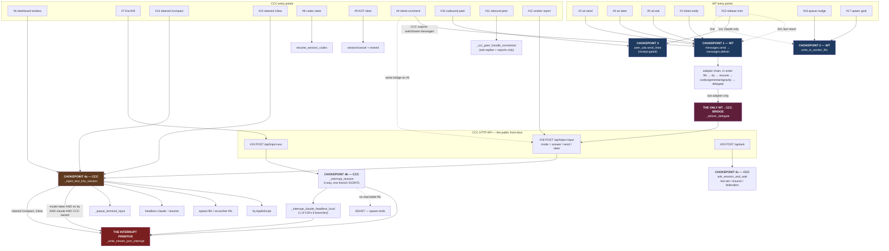

Pulled every mode branch and interrupt call site instead of guessing. Full picture, achi — the whole confusion this session came from "steer" meaning two different things.

**There are TWO interrupt mechanisms, not one.** The original version of this doc claimed only the first exists and that "anything that doesn't reach it can't interrupt." That is false, and the second one is the one that actually bit us in production.

### Mechanism 1 — the explicit control request

`_write_stream_json_interrupt` (**CCC** `server.py:53081`). It aborts an in-flight tool, ends the turn, keeps the process alive.

It has **four** call sites, not one — all in CCC, and all four first require a live CCC-owned `claude` spawn via `_find_live_spawn_entry_for_session`. A foreign session, or any non-`claude` engine, can never be interrupted, no matter what "priority" label you slap on the JSON:

| Call site | Trigger | Row |
|---|---|---|
| `server.py:60312` | steered `/compact` | #13 |
| `server.py:60326` | steered `/clear` | #14 |
| `server.py:60516` | headless steer, no tty | #6 |
| `server.py:61187` | `_interrupt_claude_headless_local` (Esc/Kill) | #7 |

**And steer ≠ interrupt.** The #6 gate is narrow (`server.py:60496`):

```python
if (mode == "steer" and not is_codex and not is_cursor
        and not is_hermes and not has_tty):
```

Steer with a tty, steer to codex/cursor/hermes, or steer to a session CCC doesn't own — all deliver *without* interrupting. Even inside the gate, the interrupt is not a semantic choice about what "steer" means. Per the comment at `server.py:60503`, it manufactures a **missing turn boundary**: a turn wedged on a long-running tool child never reaches one on its own, so `_spawn_entry_active_tool_child` would hold every queued inject indefinitely and the UI would sit on "sending…" for hours with nothing to report. The abort exists to make delivery possible at all.

> CCC line numbers drift — `server.py` is edited constantly. Grep the symbol, not the line.

### Mechanism 2 — an ordinary mid-turn stdin write (the accidental one)

**Any plain write to a live headless Claude's stream-json FIFO can act as an interrupt.** No control request, no `steer`, no mode string at all. Per `c115c5cc` (2026-08-11):

> Composer/terminal-queue-drain sends were writing straight to the live stream-json FIFO mid-turn, on the assumption that claude buffers a mid-turn stdin write and delivers it at the next boundary the same way the interactive TUI does. Community reports (Anthropic issue #41230, #63190; a third-party stream-json integration's own postmortem) say that's not a guaranteed protocol behavior — **a mid-turn write can act like steering instead of queueing.**

The old guard only looked for an active tool child, which misses the common case — a turn busy generating **text with no tool running**. CCC's hook markers (PreToolUse/PostToolUse/Stop) never fire in that window, so the session read as idle while it was mid-response. `cc8fb985` replaced it with `_headless_log_turn_open` (`server.py:53372`): a finished turn ends with exactly one `{"type":"result"}` line, so any other trailing event means the turn is still open.

**This is still live behavior by design.** From `aa9d3d26`, the shipped end state:

> Regular Send is untouched (**still the simple path, which can occasionally interrupt a busy turn**); the new option opts into deferring to the next turn boundary on any busy signal instead (never interrupts, can occasionally wait longer).

That opt-in is `force_queue` (originally spelled `mode="send_queue"`).

**Consequence for the table below.** The "Reaches `_inject_text_into_session`?" column only tracks Mechanism 1. For Mechanism 2 the question is different: *does this path write to a live headless Claude FIFO without a turn-open check?* **WT has no `_headless_log_turn_open` equivalent at all** — so #15's fifo fallback, #16 and #17 all write blind. #16 is the worst of the three: `notify_workers` skips workers idle past the floor, so it preferentially writes to **warm** workers, which are precisely the ones most likely to be mid-turn.

## Use-case map

| # | Use case | From → To | Path today | Reaches `_inject_text_into_session`? | Real interrupt today? | Should it interrupt? |
|---|---|---|---|---|---|---|
| 1 | WT ticket notify (claim/close/block, FYI) | WT queue → ticket submitter/subscriber session | **WT** — `queue.py:_notify_ticket_event` → `messages.send` | No (WT's own fifo/tty/resume adapters) | No | **No** — pure notification |
| 2 | `wt send` (ad-hoc chat) | User at CLI → any target session | **WT** — `messages.deliver`, mode=`send` | No | No | **No** — normal chat semantics |
| 3 | `wt steer` (user says "redirect NOW") | User at CLI → live WT worker session | **WT** — `messages.deliver`, mode=`steer` → WT's own fifo/tty write; only reaches **CCC** via the delegate adapter | **No, unless** target is a CCC-owned session and delegate falls through to `/api/inject-input` | **Only sometimes, by accident of routing** | **Yes** — this is the one case the whole feature name promises and mostly doesn't deliver |
| 4 | CCC ticket-comment / answered-blocked-question (server.py:2515,2543) | CCC server → idle/blocked worker session | **CCC → WT** — CCC imports `watchtower.messages` and calls `wt_messages.send(mode="steer")` | Same as #3 — depends on delegate fallthrough | Irrelevant — target is already idle/blocked | **No** — nothing running to abort, "steer" here really means "jump the queue," not "abort" |
| 5 | `wt ask` | Caller (CLI/agent) → target session, reply back to caller | **WT** — `cli.cmd_ask` → `messages.ask` (`messages.py:1805`); CCC's own parallel path is `ask_session_via_live_tail` / `ask_session_and_wait` | No | No | **No** — you want an answer without derailing current work |
| 6 | CCC dashboard textbox while session is actively running (headless, no tty, mode=steer) | User in CCC dashboard → live CCC-owned headless session | **CCC** — `_inject_text_into_session` direct, gate at `server.py:60496` | **Yes** | **Yes — real, already shipped** | **Yes**, and it works |
| 7 | Esc/Kill button | User in CCC dashboard → live CCC-owned headless session | **CCC** — the button on top of #19: `/api/inject-esc` → `_interrupt_session` → `_interrupt_claude_headless_local` (`server.py:61171`) is only **one branch** of six | Yes | Yes | **Yes**, already shipped |
| 8 | Codex steer | User in CCC dashboard → live Codex session | **CCC** — `resume_session_codex(steer=True)` | N/A — Codex-native | Yes, but coarser (cancels turn, doesn't resume mid-tool) | **Yes**, already shipped |
| 9 | ACP (Grok/Kimi) steer while busy | User in CCC dashboard → live ACP session | **CCC** — `session/cancel` + resend | N/A — ACP-native | Yes, but coarsest (kills whole turn, fresh turn after) | **Yes**, already shipped |
| 10 | CCC→foreign session outbound (`_try_uds_peer_delivery`, used by ask + cross-model bridge) | CCC → foreign (non-CCC-owned) Claude session | **CCC** — `_try_uds_peer_delivery` (`server.py:59767`); sets `priority: "now"/"next"` in JSON body, delivered via receiver's native `SendMessage` inbox | No — foreign process, no FIFO CCC controls | **Impossible**, structurally — confirmed by Anthropic's own docs, no such primitive exists on that transport | N/A — can't build what the receiving harness doesn't expose |
| 11 | CCC inbound peer socket (Slice 3, another session → CCC) | Foreign peer session → CCC-owned session | **CCC** — `_ccc_peer_handle_connection` (`server.py:59701`) — only routes ask-replies + report envelopes | No — general chat frames get logged `CCC-PEER-UNROUTED` and dropped | No, not even attempted | **No, by default** — a peer message hijacking your live dashboard session mid-tool would be a bad surprise; should stay queued unless explicitly tagged urgent |
| 12 | Worker child → parent completion report | Spawned worker child → parent session | **worker harness → CCC** — curl footer to CCC's HTTP API, or the harness's own `SendMessage` | Sometimes (report envelope path) | N/A | **No** — parent's idle/polling anyway |
| 13 | Steered `/compact` (variant of #6) | User in CCC dashboard → live CCC-owned headless session | **CCC** — `_inject_text_into_session` → interrupt → `compact_session_context` (`server.py:60312`) | **Yes** | **Yes — already shipped** | **Yes** — without it the steer was dropped and `/compact` queued behind the very turn it meant to interrupt, stacking five `/compact` entries on one session |
| 14 | Steered `/clear` (variant of #6, CCC-935) | User in CCC dashboard → live CCC-owned headless session | **CCC** — `_inject_text_into_session` → interrupt → `clear_session_context` (`server.py:60326`) | **Yes** | **Yes — already shipped** | **Yes** — routed like #13 so CCC re-keys the spawn entry to the fresh post-clear session instead of writing "/clear" to the FIFO as literal user text |
| 15 | Reconciler release instruction ("you are no longer a worker for Q") | WT reconciler → verified-idle worker session | **WT** — `release_idle_workers` (`workers.py:1706`) → `_deliver_release_instruction` (`:1007`): UDS via `peer_uds` (claude engine only, receipt-gated) → fifo → `messages.send` | Only on the last `messages.send` fallback, via the delegate — and that call passes no mode, so it arrives as `send`, never `steer` | Not via Mechanism 1. **Via Mechanism 2, yes** — the fifo fallback writes blind | **No** — release explicitly lets the session keep its unrelated conversation work; aborting a live tool to say "you're off the queue" would be hostile |
| 16 | Reconciler queue nudge — enqueue instant-pickup, stuck-queue, reconcile tick | WT reconciler → every live non-released worker on that queue | **WT** — `notify_workers` (`workers.py:767`), FIFO only, no fallback. Three callers: `dispatch_after_enqueue` (`:3633`), `_maybe_nudge_stuck_queue` (`:836`), `_reconcile_once_locked` (`:4216`) | No — never leaves WT | Not via Mechanism 1. **Via Mechanism 2, yes, and this is the worst offender** — no turn-open check, and it targets warm workers by design | **No** — "a ticket is waiting, claim it when free" is the definition of a message that must not preempt. But note the real gap: a fifo-less worker (rebound after compaction/crash) gets **nothing at all**, not even a queued copy — WATCHTOWER-14 |
| 17 | Reconciler spawn-time goal (first turn of a new worker) | WT reconciler → the worker child it just spawned | **WT** — `write_to_worker_fifo(fifo_path, goal)` (`workers.py:5049`, `:5145`) into the child's inherited stdin fd | No | N/A — nothing is running yet | N/A — this *is* the first turn, there is no in-flight tool to abort |
| 18 | `POST /api/inject-input` — the public front door | Any local HTTP caller (WT's delegate, the curl footer, the ccc-orchestration skill, dashboard JS, any script) → any session CCC can reach | **CCC** — `server.py:75775` → `_inject_text_into_session`. Accepts `mode` = `answer\|send\|steer` (and legacy `steer: true`); anything else is a 400 | **Yes — it *is* the front door to the chokepoint** | **Yes**, whenever `mode=steer` and the #6 gate holds | **Yes** — but this is the row that most needs the explicit capability answer: any local process can ask for an abort and gets no `unsupported` back when the gate doesn't hold, only a generic success |
| 19 | `POST /api/inject-esc` — pure interrupt, no text | Dashboard Esc button (#7) or any local caller → live session | **CCC** — `server.py:75992` → `_interrupt_session` (`:61212`), which has **its own six-way fall-through**, not `_inject_text_into_session`'s | N/A — different router | **Yes** — and the only path that can be **destructive**: a live headless session with no reachable FIFO gets SIGINT to its pid, ending the spawn (no mid-conversation resume) | **Yes**, but the destructive branch and the survivable one currently return the same shape — the caller cannot tell whether the session survived |
| 20 | `POST /api/ask` — synchronous inject + wait | Sibling session via curl (ccc-orchestration skill) → target session, reply returned in the response | **CCC** — `server.py:76005` → `ask_session_and_wait` (`:62217`), a **third router**: live-tail for an active target (spawns nothing), `claude --resume` for a dormant one, federation proxy if another node owns it, `ask_engine_session_and_wait` for non-claude | No — separate router | No | **No** — same as #5, you want an answer without derailing the turn |

## Call graph — where the 17 paths converge

Four chokepoints. Everything else is an entry point feeding one of them.



### Reading it

| Chokepoint | Owner | Fed by | Can interrupt? |
|---|---|---|---|
| `messages.send` → `deliver` | WT | #1, #2, #3, #4, #5, #15(last) | No |
| `write_to_worker_fifo` | WT | #15(2nd), #16, #17 | No |
| `peer_uds.send_lines` | either | #15(1st), #10 | No |
| `_inject_text_into_session` (4a) | CCC | #6, #13, #14 direct; #18 from the API; #3/#4/#15 via bridge→#18 | **Yes** |
| `_interrupt_session` (4b) | CCC | #7, #19 | **Yes — and can SIGINT-kill** |
| `ask_session_and_wait` (4c) | CCC | #20, and #5's CCC-side equivalent | No |

**The three things the picture makes obvious:**

1. **`messages.deliver` is the busiest node** — six of the seventeen. Change its adapter order and you change #1–#5 and #15 at once. That is also why the pytest leak reached a live CCC: a test touching *any* of those six walks the whole chain down to the delegate.
2. **There is exactly one WT→CCC bridge** — `_deliver_delegate`, the *last* adapter in the chain. Every "sometimes it interrupts" story in this doc is really "did the message survive five earlier adapters and reach the bridge." That is the accident #3 depends on.
3. **The interrupt primitive sits below CCC's chokepoint only.** Nothing in WT reaches it directly. `write_to_worker_fifo` — the path the reconciler actually uses for #16 and #17 — has no route to it at all.

## The actual bug in the model

**"steer" is overloaded.** It means two unrelated things depending on caller:
- "abort the running tool, right now" (#6, #7, #8, #9, #13, #14 — genuinely wired, and every one of them is CCC code against a CCC-owned spawn)
- "put my message ahead of the queue, but the target's idle anyway" (#4 — doesn't need real interrupt, just got the same mode string)

And #3 (`wt steer`, the flagship use case) only gets real interrupt **by accident**, when routing happens to fall through WT's delegate adapter into CCC's `/api/inject-input`. Any WT worker not spawned by CCC's dashboard gets zero interrupt from `wt steer` — it's silently just `send` with a label.

**The reconciler rows (#15–#17) make the asymmetry total.** WT's reconciler is the one component with a legitimate claim to preempting a worker — it is the thing that decides a worker is idle, off-queue, or needed elsewhere — and it has **no interrupt capability whatsoever**. Every reconciler→worker path is a FIFO write or a receipt-gated UDS frame; none passes `mode="steer"`, none reaches `_write_stream_json_interrupt`. That is the correct default (#15 and #16 both *should* be non-preempting), but it means the two-axis flag below has to be designed knowing that `interrupt: abort` is a capability WT can only ever borrow from CCC, never implement itself — WT does not own the spawn, so it cannot write to its stdin.

**#16 also exposes a failure mode the `mode` axis alone can't express:** a fifo-less worker isn't "delivered late," it's *not delivered at all*, silently, with `notify_workers` returning a count that omits it. Whatever replaces `mode` needs an `unsupported`/`undeliverable` result for that case too, not just for `interrupt: abort`.

## Flag proposal

Split `mode` into two independent axes instead of one overloaded string:

```
priority: queue | jump      # position in the delivery queue (today's real meaning for #4)
interrupt: none | abort     # actually abort a running tool, where the engine supports it
```

`interrupt: abort` should return an explicit `unsupported` result code (not silently downgrade to queued) when the target transport can't do it — UDS-to-foreign-session (#10) and WT's non-delegate adapters (#3 today) are exactly the cases that currently fail silent instead of failing loud.

This is where I'd stop and ask: want me to spec this as the actual rework doc (replacing "steer" call sites one by one with the two-axis flag), or do you want the Opus-5/Codex outside review to weigh in on the flag design first before anything gets written?

<session-state>
DID: Mapped every cross-session-messaging use case (12 total) against whether it reaches the one real interrupt primitive (_write_stream_json_interrupt) and whether it should.
INSIGHT: "steer" is overloaded — it means "abort running tool" in 4 places (already correctly wired) and "jump the queue, target's idle anyway" in 1 place (#4), and the flagship `wt steer` case only gets real interrupt by accident of routing, never guaranteed.
NEXT_STEP_USER: Decide whether to spec the two-axis (priority/interrupt) flag as the rework doc now, or send it to Opus-5/Codex review first.
</session-state>